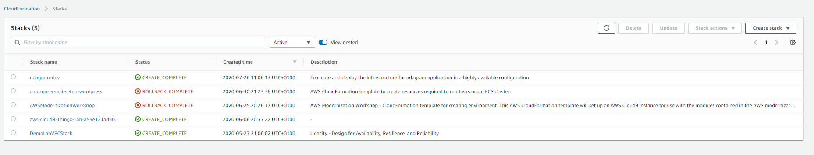
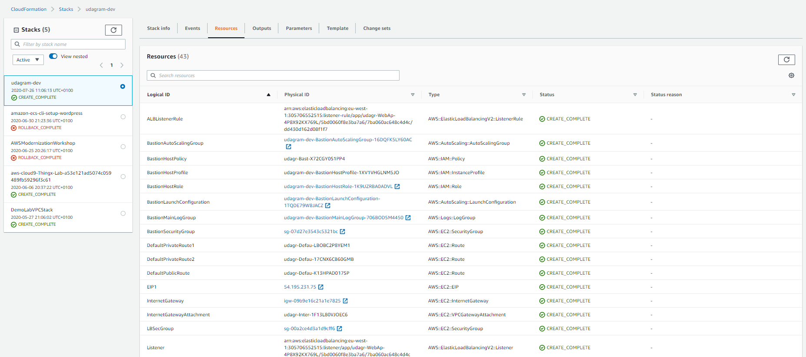

# Udacity - Project 2 - HA Web app provisioning using Cloud Formation 

This project contains the necessary scripts for automating the provisioning of social media web app called 'Udagram'.  

### Architecture 

Architecture of the solution is explained in a diagram below: 


### Prerequisites 
as mentioned in the root README.md
AWS CLI 


### How to Use
Solution contains two files:
- **cf-ha-web-infra.yml** - contains the cloud formation script for creating all necessary resources 
- **cf-ha-web-infra.parameters.json** - contains all the parameters to be passed in to CF. 

#### Create 
```
./deploy.sh -c "udagram-dev" "cf-ha-web-infra.yml" "cf-ha-web-infra.parameters.json"
```

#### Update
```
./deploy.sh -u "udagram-dev" "cf-ha-web-infra.yml" "cf-ha-web-infra.parameters.json"
```

#### Delete
```
./deploy.sh -d "udagram-dev" "cf-ha-web-infra.yml" "cf-ha-web-infra.parameters.json"
```


#### Results 
Result 1:

Result 2:

Result 3:

Result 4: 

Result 5: 

Output: 


Web App URL: http://udagr-webap-1hfm3xdbhmayd-505924935.eu-west-1.elb.amazonaws.com/ 

### References
- https://aws-quickstart.s3.amazonaws.com/quickstart-linux-bastion/templates/linux-bastion.template
- https://aws-quickstart.s3.amazonaws.com/quickstart-linux-bastion/templates/linux-bastion-master.template
- https://s3.amazonaws.com/cloudformation-templates-us-east-1/CloudWatch_Logs.template
### License 